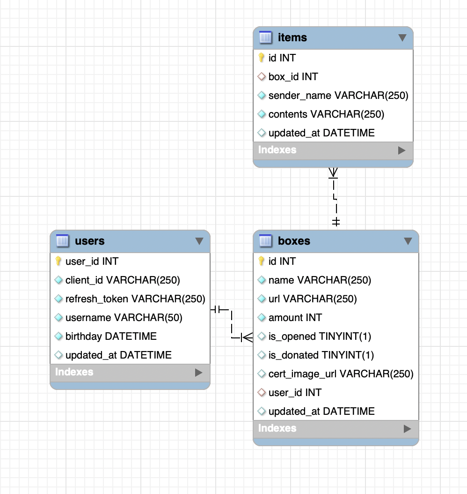
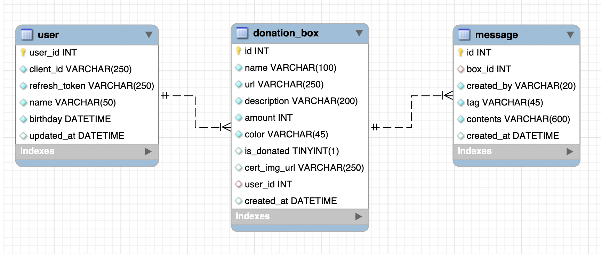

# DB 테이블 변경

## 기존 내용

## 수정 사항

### 테이블 이름을 명확하게

- boxes, items라는 테이블 이름이 명확하지 않음.
- 각각 `donation_box`, `message`로 변경함.

### 컬럼 이름을 명확하게

- items에 있는 sender_name을 `created_by`로 변경함.

### 컬럼 추가/삭제하기

- 기획상 items에 쪽지에 대한 태그가 추가되어야 함.
	- 이에 대해 `tag` 컬럼을 추가함.
- 기획상 boxes에 선물 상자에 대한 설명, 선물 상자의 색깔이 추가되어야 함.
	- 이에 대해 `description`, `color` 컬럼을 추가함.
- 기획상 boxes에 대한 is_opened 상태가 필요 없어져 삭제함.
	- is_donated와 users-birthday를 활용해 페이지 라우팅을 할 수 있음.

### 타입 지정

- birthday의 타입은 KST 기준 yyyy-mm-dd 형식의 Datetime
- tag, color는 String 타입
- url들의 타입은 String 타입인데 그 길이 설정을 다시 해야 함!

## 새 내용

